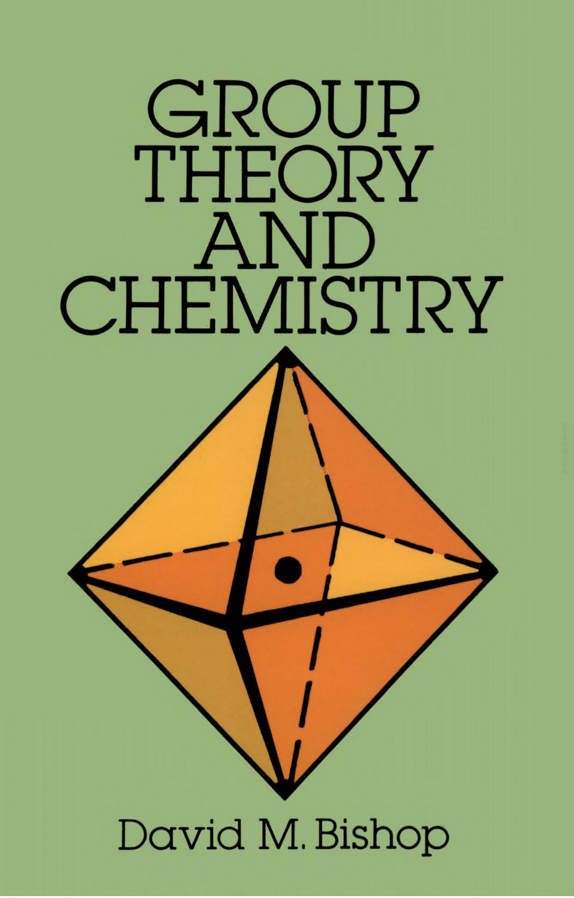

# Solution for *Group Theory and Chemistry*

## Introduction / 简介：

<table border="0">
  <tr>
    <td width="80%" style="border: none; vertical-align: top;">
      

        This repository houses my personal solutions to the end-of-chapter problems from <i>Group Theory and Chemistry</i> by David M. Bishop.
      

      <ul>
        <li>ISBN-13: 978-0-486-67355-4</li>
        <li>ISBN-10: 0-486-67355-3</li>
      </ul>
    </td>
    <td width="25%" style="border: none; vertical-align: top; text-align: center;">
      
      

        <i>Group Theory and Chemistry</i> — David M. Bishop
      

    </td>
  </tr>
</table>

## Author's Note / 作者序：

In my opinion, this book offers a lucid introduction to the basic application of the theory of point groups and their representations in chemistry, making it an outstanding textbook. However, solving the problems independently is quite a formidable task. Therefore, I have compiled their solutions for my own future reference and for the benefit of fellow learners.

在我看来，本书清晰地介绍了分子点群和其群表示在化学中的基本应用，是一本极其优秀的教材。但其求解习题颇为不易。因此，我特地整理了这些习题的答案，以备日后参考，并飨后人。

## Painting Tools or Resource of Free Pictures / 绘图工具和免费图片资源：

- Symmetry Elements Demonstration: [symotter][symotter]

- Chemical Structures Painting: [MolView][MolView]
- Stereochemistry Images: [chemtube3d][chemtube3d]
- Free Pictures: [pixabay][pixabay]

- Spherical Harmonics Painting: Python
- Functions and Geometric Combinations: [AxGlyph][AxGlyph]

- H&uuml;ckel Molecular Orbitals' Images: [Kingdraw][Kingdraw] (student edition)

## References / 参考资料

1. *Symmetry Representations of Molecular Vibrations*, authored by M.A. Wahab, published by Springer. (ISBN: 978-981-19-2801-7)
2. *Introduction to ligand fields*, authored by B. N. Figgis, published by John Wiley & Sons Inc. (ISBN: 978-0-470-25880-4)

## Contact Details / 联系方式

If you have any questions or objections to the content, you can send it to my personal email address shuangchengxue@gmail.com, and you are welcome to communicate.

如果对其中的内容有疑问或异议，可以发送至个人邮箱shuangchengxue@gmail.com，欢迎交流。

[symotter]: https://symotter.org/gallery
[MolView]: https://molview.org/
[chemtube3d]: https://www.chemtube3d.com
[pixabay]: https://pixabay.com/
[AxGlyph]: https://www.amyxun.com/
[Kingdraw]: http://www.kingdraw.cn/en
